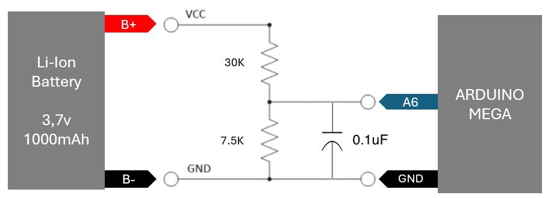

# Cómo medir el niviel de batería de un dispositivo:

## Analógiamente:

**Comparador con un divisor de voltaje a la entrada.**

**Relay (No viable)**

- Por ser mecánico además de poderse quemar con frecuencias de abierto/cerrado altas

**BJT**

Maneja corrientes, poca frecuenca de conmutación

NPN: switchea negativos
PNP: El voltaje de G debe de ser menor a S.

- Necesita mucha corriente para funcionar (modo darlington), si el dispositivo usa batería es mala idea (consumo parásito)

**MOSFET**

Maneja voltajes, alta frecuencia de conmutación

NPN: switchea negativos
PNP: El voltaje de G debe de ser menor a S

¿ Cómo se soluciona el problema de switchear un mosfet P con un MCU de una entrada de 3.3V.s

## Digitalmente:

**Utilizar un ADC con un MCU:**

