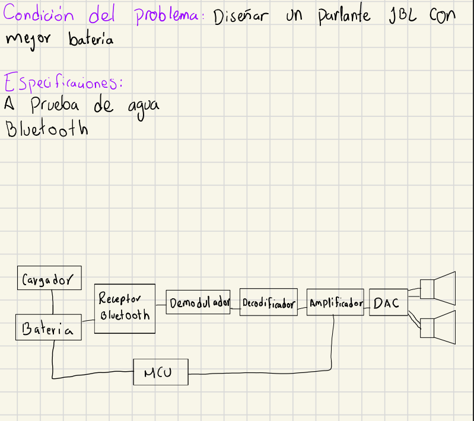

# Nombres:
- David Ramírez Betancourth
- Santiago Bustamante montoya
- Santiago Galeano Castaño
- Juan Diego Restrepo Hernandez
- Lusi Fernando Gamba

# Diseño JBL flip

- Usa baterías de litio polímero (LiPo), cada celda varía aproximadamente de 4.2 (totalmente cargada) a 2,7 V (totalmente descargada).

# Caracteristicas JBL 7 flip

- Capacidad batería 4800mA 3.6V, 14h duración
- Bluetooth 5.4
- Ancho de banda 60Hz a 20kHz
- SNR 80dB
- Tiempo de carga 2.5 h (5v/3V)
- A prueba de agua (prolipropileno, sellado con silicona)
- Certificaciones: ip67, ipx7

# Mejoras:
- Capacidad batería 16h
- Silicona tipo (coat osil 2287silane)
- speaker 5w 330204-1 (más de 25W)
- Cambiar bluetooth VHM-314 (solo receptor, 5.0)
- Batería 5000mAh (ICR26650-5000-F)
- Amplificador clase D (igual o superior a 25 W)
- Salida de 3W

